<!-- # Interactively exploring API changes and versioning consistency

Our [paper](./VISSOFT_2023_accepted.pdf) is based on APIcture, a novel tool that addresses the need for comprehensive and intuitive visualization of web API evolution.
We invite the Artifact Evaluation Committee to evaluate the practicality and effectiveness of APIcture for the reproducibility of the
visualization we included in our paper and published in the online gallery: https://souhailas.github.io/VISSOFT2023/


- This README.md is also available in a PDF readable format [here](./2023_VISSOFT_Artifact.pdf) 

- The reproducibility guide is detailed in [Reproducing the visualizations in the VISSOFT paper Section](#reproducing-the-visualizations-in-the-vissoft-paper) of this document. -->

# APIcture

APIcture is a comprehensive tool designed to empower researchers, developers, and users to gain deeper insights into
the evolution of web APIs. Our submission, APIcture, introduces an innovative approach to visualizing API changes and
versioning strategies, enabling users to comprehend the temporal sequence of changes, assess compatibility issues, and
understand versioning practices. The tool encompasses two main visualizations: API Changes and API Version Clock.
The former provides a detailed view of changes occurring at specific time intervals, while the latter offers an overarching
view of version upgrades and change patterns. Our Artifact Evaluation submission presents APIcture, detailing its
functionality, utilization, and practicality to generate API evolution visualizations. We provide clear instructions on
how to reproduce our visualization and explore other API evolution cases.

## Usage guide

### Installation

To start using APIcture, you need to install the CLI tool. Follow these steps:


   * Install Node.js and npm: APIcture requires Node.js and npm (Node Package Manager) to be installed on your system. If you haven’t already installed them, you can download them from the official Node.js website: https://nodejs.org/
      Minimum required compatible version is:v16.18.

   * Install the latest Golang version suitable to your machine: https://go.dev/dl/

   * Install APIcture using the command: `npm install apict -g`

To be sure that APIcture is properly installed, run: `apict -v` of `apict --version` this should display the current version of the artifact. 

### Basic usage

APIcture offers various subcommands that cater to different aspects of API visualization. Here are the fundamental
steps to get started with APIcture:

* **Main subcommands:** To generate the visualizations, run theapictcommand followed by the desired subcom-
mand and any additional options to generate the desired visualizations. The available subcommands include:

   - `apict <spec-path>`: Generates visualizations for the OpenAPI specification located at the specified path.
   - `apict changes <spec-path>`: Focuses specifically on changes localization.
   - `apict versioning <spec-path>`: Analyzes version upgrades versus changes types.
   - `apict metrics`: Generates visualizations for API metrics.
* **Subcommands available options:** APIcture provides several options (Figure 1) to customize the visualization
process according to the users needs:
- -r, –repo <repo>: Specifies the path to the repository containing the API’s version history. By default, the tool
uses the current working directory as the repository location.
- -o, –output <path>: Defines the path to the output directory where the generated visualizations will be saved.
If not specified, the output will be saved in the default directory.
- -fs, –fast: Activates the fast mode, which optimizes the execution for faster generation of visualizations. This
mode is only activable if the visualization has been already generated in normal mode. If not, this option is
ignored.
- -f, –format <format>: Specifies the desired output format for the generated visualizations. The available
formats include options such as PNG, SVG, and interactive HTML.
- -a, –all: Generates OpenAPI specifications for all OpenAPI files found in the repository. This option facilitates
generating visualizations for multiple specifications within the same repository.
- -fn, –filename <filename>: Specifies the output file name for the generated visualization. The tool saves the
visualization with the specified file name (without file extension) in the output directory.
- -h, –help: Displays the help information for the command, providing a concise overview of the available
options.
- -v, –version: Displays the current version of the tool.
- -c, -clean: Deletes the artifacts used in the fast mode.

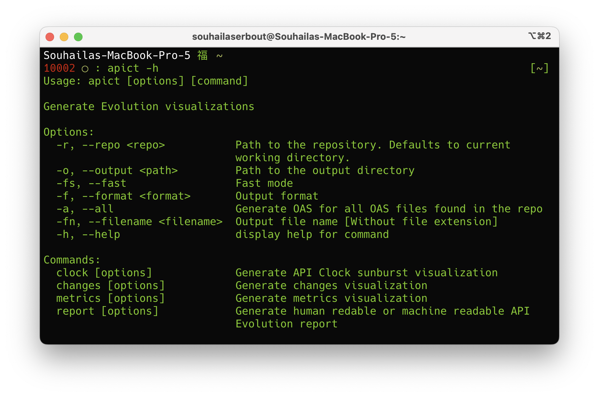
<p style="text-align: center;" ><em >Figure 7: Help Subcommand</em></p>

### Use case example

This section provides comprehensive instructions for generating visualizations from a real world repository using the
commands and options listed earlier.
For illustrative purposes, we have included sample API GitHub repositories containing OpenAPI specifications in
our GitHub Repository (https://github.com/souhailaS/APIcture/blob/main/git_urls.json).


We pick the OpenAI API project (https://github.com/openai/openai-openapi.git) as our example. Begin by cloning the repository to your local machine:

```
git clone https://github.com/openai/openai-openapi
```

Next, navigate into the repository:
```
cd openai-openapi
```

Figure 8 depicts the structure of the OpenAI API repository, revealing the top-level placement of the OpenAPI
specification file (openapi.yaml).

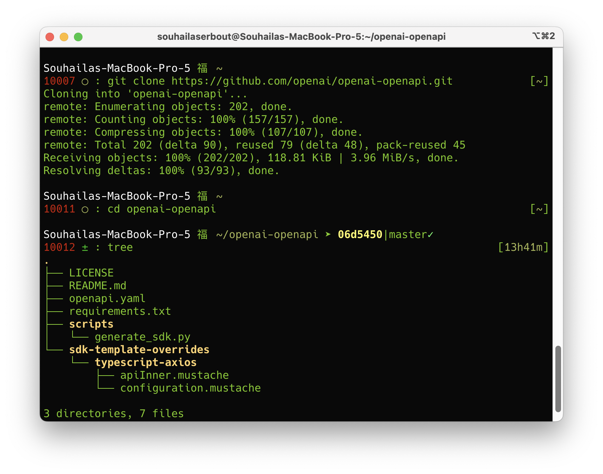
<p style="text-align: center;" ><em >Figure 8: Repository Structure: OpenAI API</em></p>

To generate all evolution visualizations at once, simply execute: `apict`.
Alternatively, utilize the `apict` command with the `-r` option, which will run the visualizations generation without need to navigate to the repository:

```
apict -r openai-openapi
```

In the absence of a specific file path, APIcture automatically locates all OpenAPI specification files within the
repository and prompts the user to select one (Figure 9).

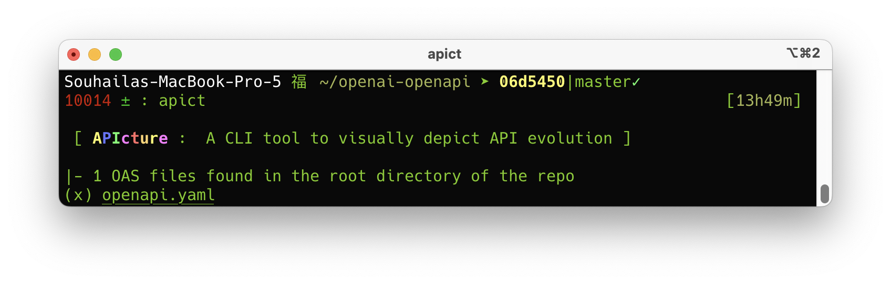
<p style="text-align: center;" ><em >Figure 9: apict Command Line: Generating Visualizations</em></p>

To generate visualizations for all OpenAPI specifications within the repository, apply the `-a [–all]` option:


```
apict -r openai-openapi -a
```


Generated visualizations are stored within theAPIcturefolder, organized under a directory named after the respective
specification. For instance, in this case, the visualizations are located withinAPIcture/openapi (Figure 12). 

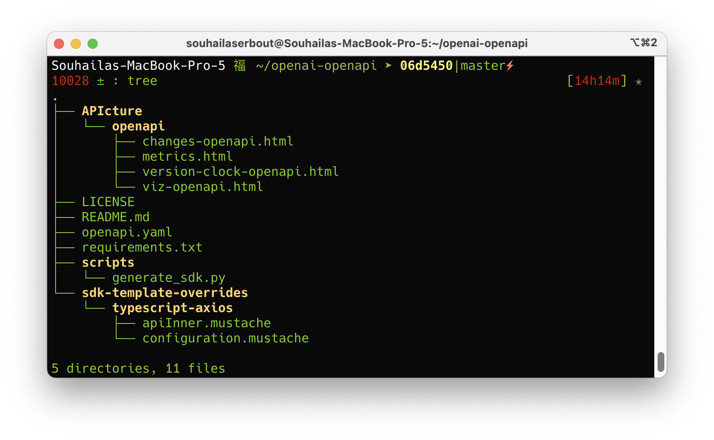
<p style="text-align: center;" ><em >Figure 12: apict command outputs</em></p>

By default, if no format is given, the output format is HTML.
The generated HTML files are:

- changes-<openapi api file name>.html: an interactive format of the API Changes visualization.
- version-clock-<openapi api file name>.html: an interactive format of the API Version Clock visualization.
- version-clock-<openapi api file name>.html: an interactive format of six API evolution metrics plots (Figure 10).

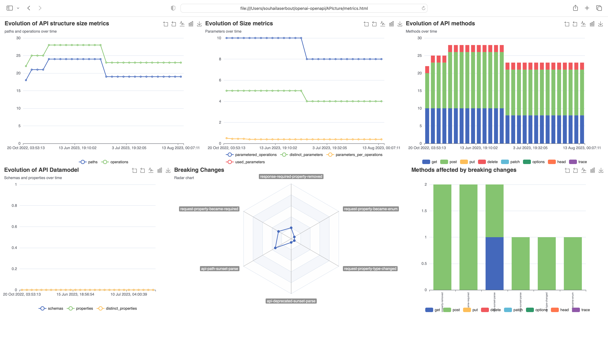
<p style="text-align: center;" ><em >Figure 10: apict metrics visualization</em></p>

- viz-<openapi api file name>.html: a single HTML page that includes all the previous interactive visualiza-
    tions, in addition to a header showing history related metadata (Figure 11).

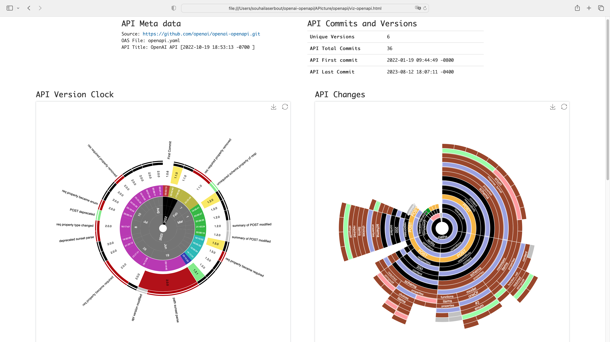
<p style="text-align: center;" ><em >Figure 11: apict output evolution visualizations</em></p>

When executing the `apict` command without specifying any additional options, it initiates the process of generating
an evolution report directly within the terminal (Figure 13). Furthermore, for users seeking to access this report
independently of the complete visualization generation process, the report subcommand can be employed.

```
apict report -r openai-openapi
```

Rather than being limited to using only the overarching `apict` command, users have the flexibility to employ focused
subcommands. Each of these subcommands generates a specific output individually, allowing for a more tailored
approach to visualization creation. In addition to this, the–fastoption is provided to optimize the time taken in the
generation process, particularly when users are exclusively interested in obtaining a particular output. This approach
streamlines the generation time, making the process more efficient and relevant to the specific visualization needs of
the user.


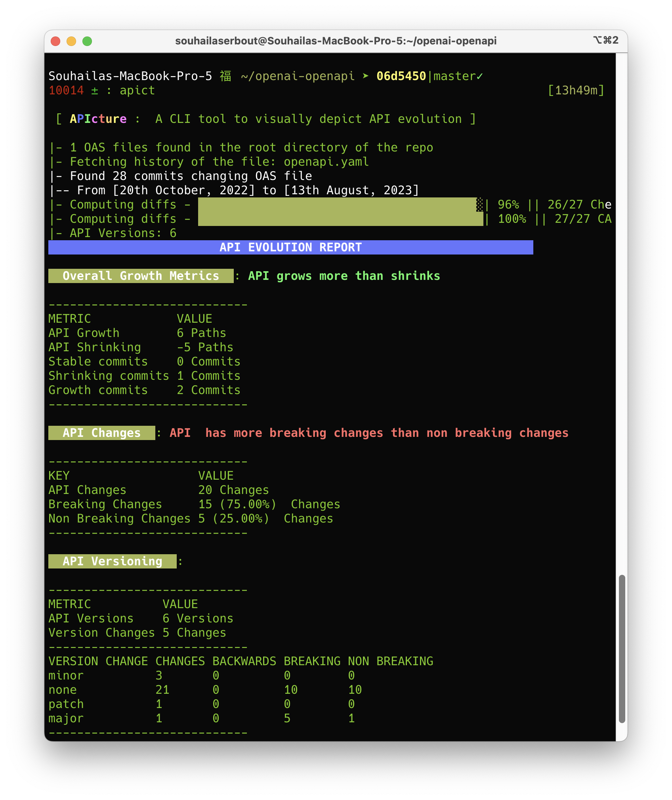
<p style="text-align: center;" ><em >Figure 13: apict terminal prompt</em></p>

### Other supported cases

In scenarios where no OpenAPI file is detected within the repository (Figure 14), APIcture employs a distinct approach
for Express.js projects. It systematically generates a corresponding OpenAPI specification from the project’s codebase
for each commit existing in the repository’s history. Subsequently, APIcture selects the specifications that exhibit
differences from the specification of the preceding commit. This generation process leverages [ExpressO[2]](https://www.npmjs.com/package/expresso-api) a CLI tool
designed to validly generate OpenAPI specifications from expressjs code. The generated specifications are then utilized
by APIcture to generate the intended visualizations.
In the case where the project’s dependencies are not already installed, select(x) Nothen rerun theapictcommand.
It is important to note that the showcased examples within our published gallery exclusively originate from projects that
feature an accessible OpenAPI specification within the repository. In this version of APIcture, the effective generation of
visualizations through Express.js code hinges on the capability of ExpressO to construct a specification from the underlying
codebase.

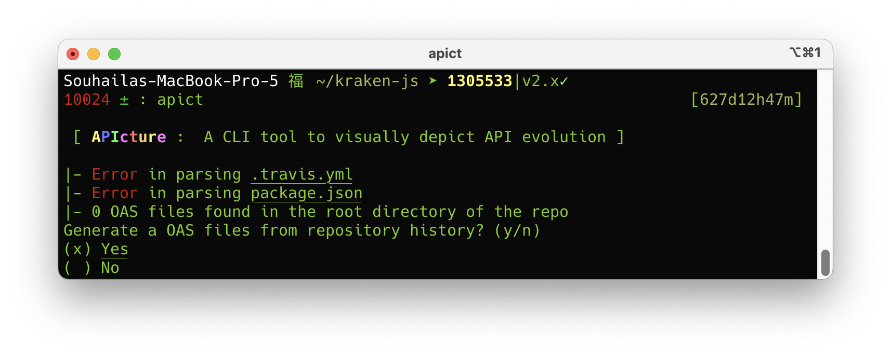
<p style="text-align: center;" ><em >Figure 14: APIcture - No OpenAPI File</em></p>


### Reproducing the visualizations in the VISSOFT paper

To facilitate the reproducibility of the visualizations showcased in the public gallery, we have introduced a temporary command that streamlines the generation of all visualizations in a single run:

`apict vissoft`

By executing this command, APIcture automatically clones a predefined list of GitHub repository URLs, thoughtfully provided within the APIcture repository. It is important to note that an active internet connection is required to retrieve these Git repositories from GitHub. The command subsequently generates visualizations for all the cloned repositories, and as an added benefit, it creates an index.html page. This page serves as a convenient navigation hub, allowing users to seamlessly explore and access all the generated visualizations in a coherent manner.

When utilizing the command apict vissoft, users will initially be prompted to provide  the JSON file containing the array of URLs of the repositories to clone, and a destination folder path where the repositories will be cloned. The JSON file can be downloaded from: [https://github.com/souhailaS/APIcture/blob/main/git\_urls.json ](https://github.com/souhailaS/APIcture/blob/main/vissoft/git_urls.json). You can customize this file and remove some of the URLs if you want to test it with fewer URLs (Figure 1). 

***If no path of the JSON file containing the URLs of the repositories to clone is given or the inserted path is invalid, it will be defaulted to the git_urls.json included in APIcture's repository.  In case the user opts not to input any path, the current location will automatically be designated as the destination folder for the cloned repositories***


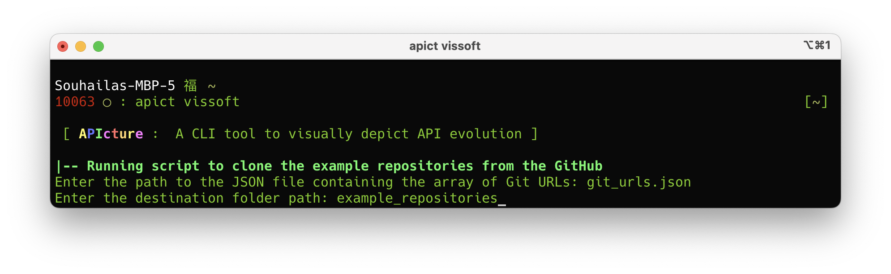
<p style="text-align: center;" ><em >Figure 1: Console after running apict vissoft</em></p>


 If the specified destination folder does not exist, the tool will automatically create it. The repositories are then cloned one after the other showing in the console the state of the cloning phase (Figure 2).

 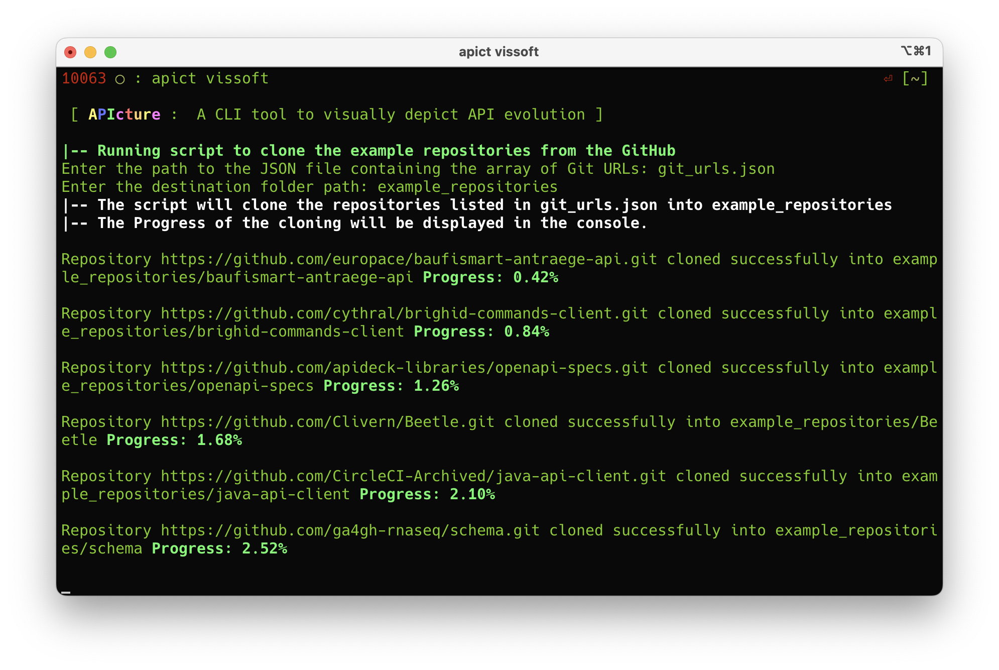
 <p style="text-align: center;" ><em >Figure 2: Console showing the progress of the projects cloning phase</em></p>

 On the other hand, if the folder already exists, the user will be prompted to decide whether they want to completely recreate the folder from scratch and subsequently clone all the repositories into it. If the user chooses not to recreate the folder from scratch, the system will provide information about the number of repositories present within that folder. Following this, the generation of visualizations for the existing APIs in the folder will commence (Figure 3). In scenarios where no repositories are present in the designated folder, the tool will proceed to clone the repositories before initiating the process of visualization generation.


 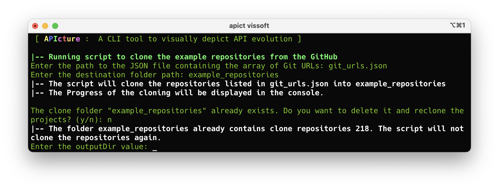
   <p style="text-align: center;" ><em >Figure 3: Cloning destination folder already exists</em></p>


Upon completion of the cloning process, the user will be prompted to specify a path for the destination folder where the resulting visualizations will be stored. In the event that no path is provided, the current directory will be regarded as the destination (Figure 4). 

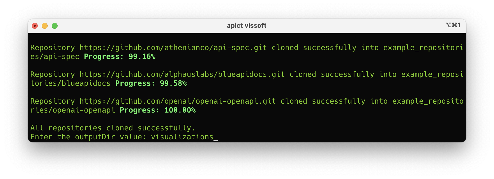
<p style="text-align: center;" ><em >Figure 4: Destination folder where to save the generated visualizations</em></p>

Subsequently, a directory named VISSOFT will be established within the designated destination folder. This directory will accommodate the entire collection of generated artifacts. These artifacts encompass individual visualizations for each API, accompanied by an index.html file. The latter functions as a navigational interface, enabling access to each of the generated visualizations (Figure 5).

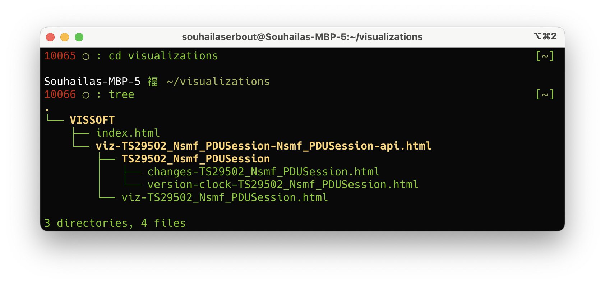
<p style="text-align: center;" ><em >Figure 5: Structure of the generated output</em></p>

To generate the outputs APIcture systematically parses all files within the projects with the extensions .yaml or .json, and subsequently assesses whether these files conform to the OpenAPI specification. Upon detecting valid OpenAPI files, the tool proceeds to retrieve their complete version histories. Subsequently, APIcture initiates the generation of visualizations for each identified OpenAPI file, following the comprehensive procedure delineated in Figure 3 of [1](./VISSOFT_2023_accepted.pdf).

It is important to note that a single repository might contain OpenAPI files pertaining to multiple APIs. To effectively handle this scenario, APIcture structurally organizes the generated outputs, considering both the repository's name and the name of the respective OpenAPI file. 

In the event that the script is terminated during the visualization generation phase and is subsequently restarted, the user will be presented with the choice of either resuming visualization generation for projects that were not previously processed or reinitiating the entire procedure (Figure 6). It is noteworthy that this phase does not necessitate an internet connection. The repositories history is locally fetched from git history.

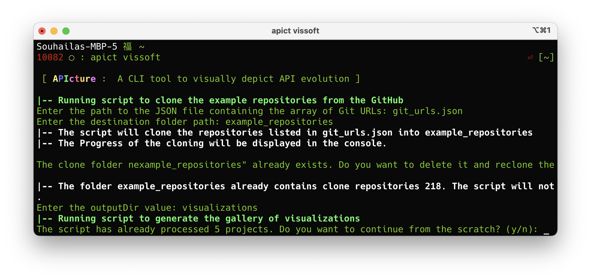
<p style="text-align: center;" ><em >Figure 6: Cloned projects have already been processed</em></p>


## Contact
You can contact us by email: souhaila.serbout@usi.ch

Issues can be also added to the public repository of APIcture: https://github.com/souhailaS/APIcture. We are currently
actively enhancing and maintaining it.


## Extrnal Links

(^1) https://github.com/souhailaS/APIcture/blob/main/vissoft/git_urls.json

(^2) https://github.com/openai/openai-openapi.git

(^3) https://www.npmjs.com/package/expresso-api

(^4) https://souhailas.github.io/VISSOFT2023/

## References
[1] Souhaila Serbout, Diana Carolina Muñoz Hurtado, and Cesare Pautasso. Interactively exploring API changes and versioning consistency. In 11th
IEEE Working Conference on Software Visualization (VISSOFT 2023), Bogota, Colombia, October 2023. IEEE. [ 🏆 Best Paper Award]

[2] Souhaila Serbout, Alessandro Romanelli, and Cesare Pautasso. Expresso: From express.js implementation code to openapi interface descriptions. In
Thais Batista, Tomáš Bureš, Claudia Raibulet, and Henry Muccini, editors,Software Architecture. ECSA 2022 Tracks and Workshops, pages 29–44,
Cham, 2023. Springer International Publishing. ISBN 978-3-031-36889-9. [ 🏆 Best Tools and Demos Paper Award]


